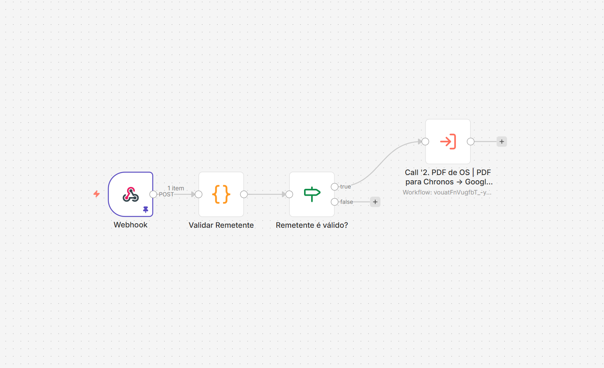
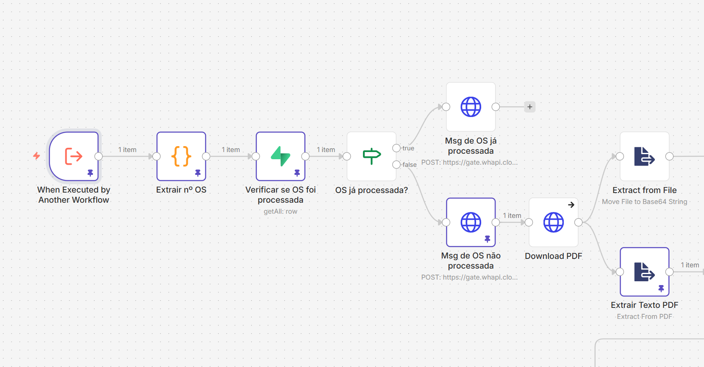
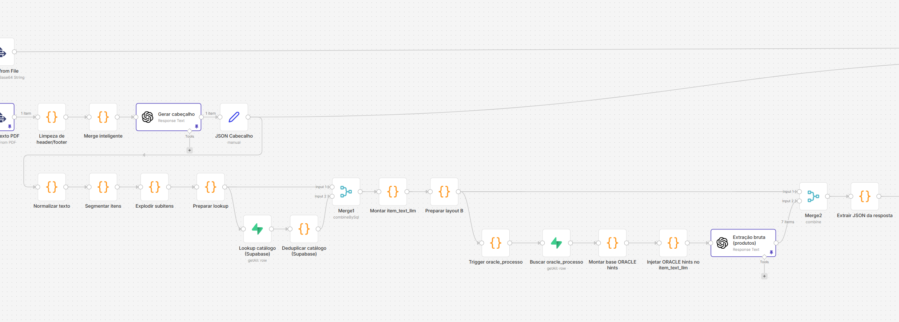
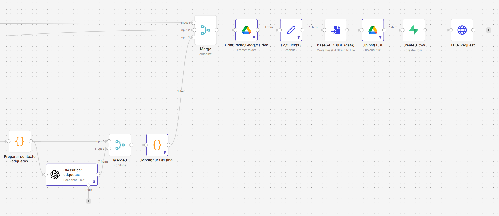
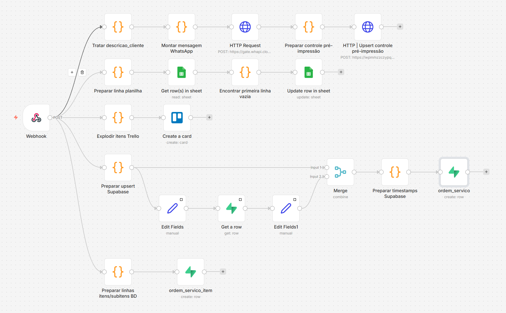

# Workflow de processamento de PDFs de OS para operação de produção

Case técnico de automação operacional baseado em workflows encadeados para recebimento, validação, processamento e distribuição de PDFs de ordens de serviço em ambiente produtivo.

> **Nota:** este repositório contém uma versão sanitizada de uma automação real.  
> Credenciais, IDs, URLs, nomes sensíveis e dados operacionais foram anonimizados para publicação pública.

## Resumo executivo

Este case apresenta uma automação operacional baseada em três workflows encadeados para processamento de PDFs de ordens de serviço em ambiente produtivo.

A arquitetura foi estruturada para receber eventos de entrada, validar documentos elegíveis, processar informações operacionais e distribuir saídas para canais definidos, mantendo rastreabilidade e separação clara de responsabilidades.

A publicação foi adaptada para portfólio público por meio de sanitização completa dos dados sensíveis.]

## Competências demonstradas

Este projeto demonstra experiência prática em:

* Construção de soluções ponta a ponta utilizando workflows desacoplados
* Integração entre sistemas utilizando APIs e comunicação orientada a eventos
* Transformação de documentos não estruturados em dados operacionais reutilizáveis
* Estruturação e distribuição automatizada de informações
* Modelagem de processos operacionais
* Manipulação e consolidação de payloads em JSON
* Desenvolvimento de lógica aplicada em automações
* Observabilidade, rastreabilidade e manutenção de fluxos produtivos

## Problema

Em operações que dependem de ordens de serviço em PDF, o fluxo manual de recebimento, triagem, organização e distribuição tende a gerar gargalos, risco de duplicidade, falhas de roteamento e perda de padronização operacional.

Além disso, quando o processo depende de múltiplos pontos de contato, a ausência de uma arquitetura modular dificulta manutenção, auditoria e evolução futura da automação.

## Estratégia arquitetural

A solução foi dividida em workflows independentes e encadeados, cada um responsável por uma etapa específica do processo operacional.

Essa separação reduz acoplamento entre etapas, facilita manutenção, melhora rastreabilidade e permite evolução isolada de componentes do fluxo.

## Arquitetura da automação

### Workflow 1 — Entrada e validação
Responsável por receber o gatilho inicial, validar o evento e encaminhar apenas PDFs elegíveis para o fluxo principal.

### Workflow 2 — Processamento e estruturação
Responsável por tratar o documento, organizar a persistência do arquivo e preparar os dados necessários para a etapa operacional.

### Workflow 3 — Distribuição operacional
Responsável por publicar a saída final nos canais operacionais definidos, concluindo o fluxo ponta a ponta.

## O que este case demonstra

Este projeto foi estruturado para representar uma implementação operacional real, priorizando organização, rastreabilidade e manutenção dos fluxos.

Aspectos destacados:

- decomposição de processo operacional em workflows desacoplados
- tratamento automatizado de documentos em ambiente produtivo
- separação clara de responsabilidades entre entrada, processamento e distribuição
- transformação de PDF em dados estruturados reutilizáveis
- distribuição multicanal a partir de um payload consolidado
- preocupação com rastreabilidade, manutenção e privacidade
- adaptação segura de projeto real para publicação pública

## Stack utilizada

- **n8n** — orquestração, execução e desacoplamento dos workflows
- **Webhooks** — recebimento assíncrono dos eventos de entrada
- **REST APIs** — integração e comunicação entre serviços
- **Google Drive** — persistência e organização documental
- **Google Sheets** — apoio operacional e estruturação de registros
- **WhatsApp API** — distribuição das saídas operacionais
- **JSON** — comunicação estruturada entre workflows
- **JavaScript** — transformação de dados e regras operacionais nos fluxos
- **Documentação sanitizada** — adaptação segura para publicação pública

## Fluxo macro

1. Recebimento do evento de entrada
2. Validação do remetente, tipo de arquivo e padrão do PDF
3. Encaminhamento da OS elegível para processamento
4. Extração e estruturação das informações do PDF
5. Organização do arquivo e metadados em armazenamento externo
6. Consolidação de payload operacional
7. Distribuição para mensageria, planilha, cards e banco de dados

## Decisões técnicas relevantes

Durante o desenvolvimento foram adotadas algumas decisões para reduzir acoplamento e facilitar manutenção:

- Separação por responsabilidade
Cada workflow executa apenas uma responsabilidade principal (entrada, processamento ou distribuição).

- Comunicação estruturada
A troca entre etapas ocorre através de payloads intermediários em formato JSON.

- Processamento em múltiplas etapas
A estrutura foi dividida para facilitar validação, depuração e evolução isolada de cada componente.

- Publicação segura
Os fluxos foram sanitizados para manter a estrutura técnica sem expor dados operacionais reais.

## Exemplos públicos

A pasta [`samples/`](samples/README.md) contém exemplos fictícios baseados na arquitetura real do fluxo.

Os arquivos mostram a evolução dos dados entre entrada validada, processamento estruturado e distribuição operacional, sem expor payloads reais de produção.

## Capturas de tela

As capturas abaixo ilustram a separação funcional entre entrada, processamento e distribuição do fluxo.

### Workflow 1 — Entrada e validação


### Workflow 2 — Processamento e estruturação
**Parte A — preparação inicial**



**Parte B — tratamento intermediário**



**Parte C — consolidação da saída**



### Workflow 3 — Distribuição operacional


## Estrutura do repositório

```text
.
├── README.md
├── .gitignore
├── assets/
│   ├── screenshots/
│   ├── diagramas/
│   └── exemplos/
├── docs/
│   ├── README.md
│   ├── 00-planejamento.md
│   ├── 01-visao-geral.md
│   ├── 02-arquitetura.md
│   ├── 03-privacidade.md
│   ├── 04-checklist-publicacao.md
│   ├── 05-workflow-1-entrada-validacao.md
│   ├── 06-workflow-2-processamento-estruturacao.md
│   ├── 07-workflow-3-distribuicao-operacional.md
│   ├── sanitizados_ptbr_convensao.md
│   └── checagem_final_sem_dados_sensiveis.json
├── samples/
│   ├── README.md
│   ├── entrada/
│   │   └── entrada-validada.json
│   ├── processamento/
│   │   ├── cabecalho-estruturado.json
│   │   ├── itens-estruturados.json
│   │   └── payload-distribuicao.json
│   └── distribuicao/
│       ├── item-operacional.json
│       ├── linha-planilha.json
│       ├── mensagem-operacional.md
│       └── registro-os.json
└── workflows/
    └── sanitizados/
        ├── 01-entrada-validacao.sanitizado.json
        ├── 02-processamento-estruturacao.sanitizado.json
        └── 03-distribuicao-operacional.sanitizado.json
```

## Como navegar neste case

- **Visão executiva:** este README principal
- **Documentação técnica estruturada:** [Índice da documentação técnica](docs/README.md)
- **Detalhamento dos workflows:** documentação individual em `docs/`
- **Inspeção dos fluxos exportados:** [workflows sanitizados](workflows/sanitizados/)
- **Exemplos públicos:** [samples](samples/README.md)

## Privacidade e publicação

Este material foi preparado para publicação pública com foco em portfólio técnico.

Foram removidos ou anonimizados:

- credenciais
- URLs internas
- identificadores sensíveis
- nomes operacionais
- referências privadas de ambiente

Os arquivos sanitizados preservam a arquitetura e a lógica do fluxo sem expor dados operacionais reais.

## Resultados esperados da solução

A arquitetura proposta busca gerar ganhos operacionais por meio de:

- redução de atividades manuais de triagem e encaminhamento
- maior consistência no tratamento de documentos
- aumento da rastreabilidade entre entrada, processamento e distribuição
- menor acoplamento entre etapas do fluxo
- estrutura mais simples de manter, auditar e evoluir

## Documentação complementar

- [Índice da documentação técnica](docs/README.md)
- [Arquitetura macro](assets/diagramas/arquitetura-macro.md)
- [Workflow 1 — Entrada e validação](docs/05-workflow-1-entrada-validacao.md)
- [Workflow 2 — Processamento e estruturação](docs/06-workflow-2-processamento-estruturacao.md)
- [Workflow 3 — Distribuição operacional](docs/07-workflow-3-distribuicao-operacional.md)
- [Convenção dos arquivos sanitizados](docs/sanitizados_ptbr_convensao.md)
- [Checklist de publicação](docs/04-checklist-publicacao.md)
- [Samples públicos](samples/README.md)

## Status

Case técnico revisado para portfólio público

A versão disponível preserva a arquitetura, o fluxo operacional e a lógica de processamento da automação real, mantendo workflows, documentação e materiais visuais em formato sanitizado.

Os exemplos públicos em `samples/` estão estruturados por estados arquiteturais e podem ser evoluídos com payloads fictícios derivados do fluxo real.
